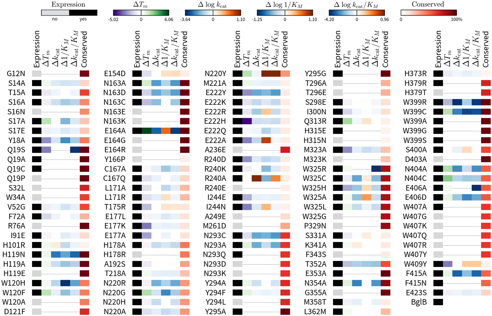

# Investigating functional effects of mutations in a model enzyme to improve molecular modeling algorithms 

This is the main repository for an ongoing project in the Siegel group to design and characterize the Michaelis-Menten kinetics and stability of mutants of a β-glucosidase (_BglB_, nicknamed "Bagel"). We are investigating how point mutations to enzymes change functional parameters, stabilty, and structure, and building a large data set of characterized variants to improve molecular modeling algorithms. 

## For students

Welcome to the Bagel Team! You are expected to complete the following steps over the course of 3-6 months. 

### 1. Background reading 

+ [BglB crystal structure](http://www.sciencedirect.com/science/article/pii/S0022283607007413)
+ [Our group's first paper on Bagel project](http://journals.plos.org/plosone/article?id=10.1371%2Fjournal.pone.0147596)

### 2. Get started with using Foldit for protein design 

First, get a [our group's internal copy of Foldit](http://fold.it/dist/internal/build/). Then, download the [BglB Rosetta model](http://github.com/dacarlin/bagel-foldit), which comes with instructions for using Foldit. 

### 3. Wet lab "boot camp" 

Get started in the wet lab by following the [protocols for protein production, purification, and kinetic assay](http://github.com/dacarlin/bagel-protocol) to produce, purify, and assay the BglB wild type protein, GFP, and two mutants. 

### 4. Produce, purify, and assay your mutants in the wet lab

Following the procedures you learned in "boot camp", kinetically characterize the mutants that you designed. You will continue this step until your data is suitable for publication, as determined by the data reporting guidelines in the [BglB protocol](bagel-protocol). 

### 5. Analyze your data and learn from the mutations you designed

Analyze your data using the [data analysis tools](http://github.com/dacarlin/bagel-fitter) ([internal UC Davis link](http://bagel.genomecenter.ucdavis.edu) and write up your results. Learn how the mutations you made changed the kinetic properties of BglB.

### 6. Design a second set of mutants that build on your ideas from the first set 

### 7. Produce, purify, and assay your second round of mutants 

Following the procedures you learned in "boot camp", kinetically characterize the second round of mutants that you designed. 

### 8. Analyze and compile all your data 

Analyze your data using the [data analysis tools](http://github.com/dacarlin/bglb_fitter) ([internal (UC Davis) link](http://bagel.genomecenter.ucdavis.edu) and write up your results. 

### Write up your results for publication on BioArXiv

Write a short paper describing what you have found. 

## For teachers 

### Oligo design and Kunkel mutagenesis

+ [A complete set of mutageneic oligos for the BglB gene](http://github.com/dacarlin/bagel-orders) is provided, but students should have the experience of either 1) writing the code to generate all possible oligos for the BglB sequence (see repository for data), or 2) designing an oligo "by hand" using DNA editing software 

+ there is a rough version of the Kunkel mutagenesis protocol in [the provided protocols](http://github.com/dacarlin/bagel-protocol), and a [more complete Kunkel protocol on the Siegel group website](https://drive.google.com/drive/folders/0B3zIXvOOrmpqcEM5WWRadThsVUE)

